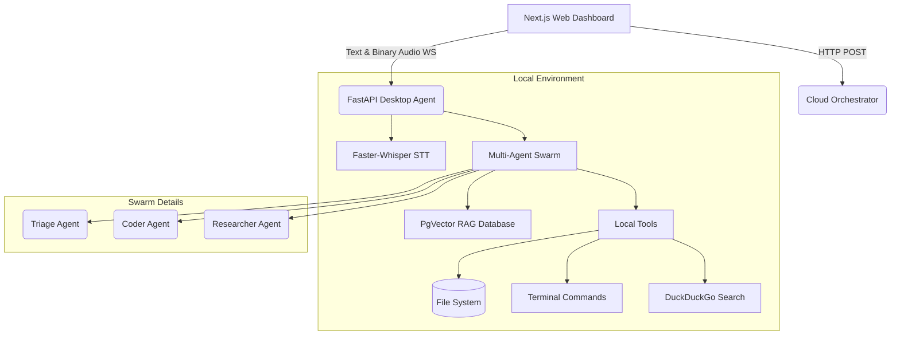

# Jarvis: Autonomous Multi-Agent AI Assistant

Jarvis is a next-generation, privacy-first, multimodal AI assistant designed primarily for developers. It breaks out of the traditional linear chatbot paradigm by employing an **Autonomous Multi-Agent Swarm** that can interact with your local file system, research the web, index codebases, run background jobs, and listen to voice commands.

## 🚀 Key Features

*   **Multi-Agent Swarm Orchestration**: Tasks are intelligently routed and handled by specialized agents rather than a single monolithic model.
*   **Extensible Skills Framework**: Jarvis learns new abilities via a dynamic, markdown-based skills folder. Adding a new skill is as easy as writing a `SKILL.md` file!
*   **Local Action Execution**:
    *   File system read/write operations (sandboxable).
    *   Terminal command execution.
    *   Background process spawning (e.g., starting dev servers independently).
*   **RAG Codebase Indexing**: Utilizes PostgreSQL with the `pgvector` extension to semantically index and search massive codebases locally.
*   **Privacy-First Voice UI**: Local Speech-to-Text via `faster-whisper`. The frontend streams raw WebM binary audio over WebSockets directly to your machine, bypassing third-party cloud audio APIs.
*   **Modular Architecture**: Built with FastAPI, utilizing a strict Dependency Injection container for swapping providers (Local Ollama vs. Cloud GPT-4o).

---

## 🏗️ System Architecture

The project consists of three main pillars: The Next.js Web Dashboard, the FastAPI Local Desktop Agent (`jarvis_backend`), and a Cloud Orchestrator.



### 1. The Multi-Agent Swarm
When a prompt arrives (via text or transcribed voice), it hits the **Swarm Coordinator**. 
*   **Triage Agent**: The default receptionist. Handles general questions and routes complex technical tasks to the Coder or Researcher.
*   **Coder Agent**: Equipped with tools to read/write files, execute terminal commands, run background jobs, and index codebases.
*   **Researcher Agent**: Dedicated to utilizing web search and URL fetching to read up-to-date documentation and answer queries before handing execution back to the Coder.

### 2. The Skills Framework
In `jarvis_backend/skills/`, you'll find folders like `background_execution` and `project_researcher`. Each contains a `SKILL.md` file. At startup, the `SkillLoader` parses these markdown files to inject system prompts and allowed tools directly into the agents.

### 3. Audio & Voice Streaming
The Next.js frontend utilizes the browser's `MediaRecorder` API. When the user clicks the mic, it captures chunks of `audio/webm` and streams them via WebSockets (`ws://localhost:8000/ws`). The FastAPI backend intercepts binary payloads, buffers them, and runs them through `faster-whisper` (running entirely on CPU/GPU locally). The transcribed text is then fed into the Swarm seamlessly.

---

## ⚙️ Prerequisites

*   **Node.js & npm**: v18+ (for the frontend)
*   **Python**: 3.10+ (for the backend and AI models)
*   **Docker & Docker Compose**: For PostgreSQL (with pgvector), Redis, and Traefik.
*   **System Dependencies**: 
    *   `portaudio19-dev` (for PyAudio)
    *   `ffmpeg` (for faster-whisper audio decoding)
    *   *Ubuntu*: `sudo apt install ffmpeg portaudio19-dev`
    *   *Mac*: `brew install ffmpeg portaudio`

---

## 🚀 Installation & Setup

### Step 1: Start Core Infrastructure (Docker)
We use Docker to spin up our databases and API gateways.
```bash
# Clone the repository
cd Jarvis

# Start background services
docker-compose up -d
```
*This starts Postgres on `5432`, Redis on `6379`, and Traefik on `80`.*

### Step 2: Configure & Start the Local Backend
The `jarvis_backend` houses the AI Swarm and WebSocket server. It runs on port `8000`.

```bash
# Navigate to backend
cd jarvis_backend

# Create a virtual environment (Recommended)
python3 -m venv venv
source venv/bin/activate

# Install requirements
pip install -r requirements.txt

# Start the FastAPI server
python app.py
```
## 🧪 Running Tests

You can run tests from the root directory using:

```bash
PYTHONPATH=. pytest
```
or
```bash
python -m pytest
```
> **Note on Voice UI**: The first time you speak into the microphone, `faster-whisper` will download the `base.en` model (approx. 140MB). This happens automatically but may cause a slight delay on the first use.

### Step 3: Start the Web Dashboard
The web dashboard is a Next.js application that provides the graphical interface, glowing orb, and Push-To-Talk microphone.

```bash
# Open a new terminal window
cd apps/web-dashboard

# Install Node dependencies
npm install

# Start the dev server
npm run dev
```
Navigate to [http://localhost:3000](http://localhost:3000) in your browser. 

---

## 🎮 Usage Examples

Once everything is running, try the following interactions either by typing or using the **Microphone** button:

1.  **Background Execution**:
    *   *"Jarvis, run `npm install` in the background and let me know when it's done."*
    *   The Coder agent will use the `RunBackgroundCommandTool` and continue talking to you while the installation runs.
2.  **Codebase Indexing (RAG)**:
    *   *"Index my current project directory so you can answer questions about it."*
    *   Jarvis will parse, chunk, and embed your code into PostgreSQL via pgvector.
3.  **Research & Execution**:
    *   *"Research the newest Next.js App Router caching behavior, then write a file called `cache_test.tsx` demonstrating it."*
    *   The Swarm will hand off to the **ResearcherAgent** to search the web, then pass the findings to the **CoderAgent** to write the file.

---

## 🛠️ Project Structure
```text
Jarvis/
├── apps/
│   └── web-dashboard/        # Next.js React Frontend (Tailwind + Framer Motion)
├── jarvis_backend/           # FastAPI Local Python Backend
│   ├── api/                  # REST and WebSocket routes
│   ├── app/                  # Dependency Injection container
│   ├── audio/                # STT (Whisper) and TTS pipelines
│   ├── core/                 # Memory stores, Swarm orchestration
│   ├── skills/               # Markdown-based agent abilities
│   └── tools/                # Python tool implementations (Search, FS, CLI)
├── docker-compose.yml        # Infrastructure setup
└── requirements.txt          # Python dependencies
```

## 🤝 Contributing
Want to teach Jarvis a new trick? 
1. Create a new folder in `jarvis_backend/skills/`.
2. Add a `SKILL.md` file describing what the skill does and when an agent should use it.
3. Restart the backend. Jarvis will automatically learn it!
